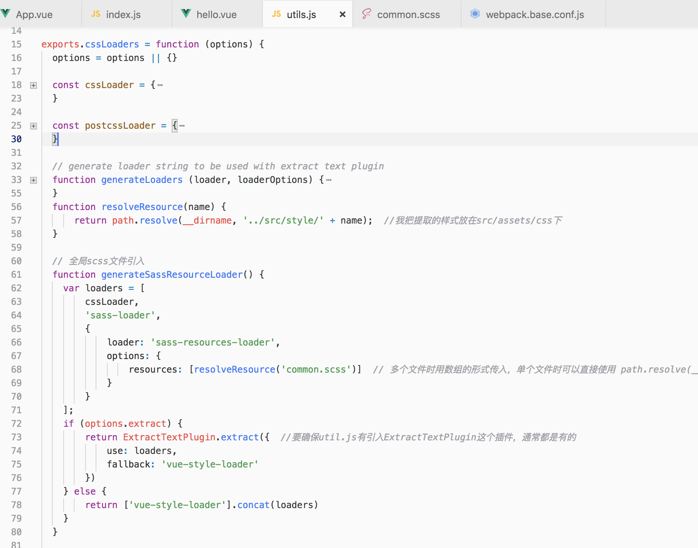
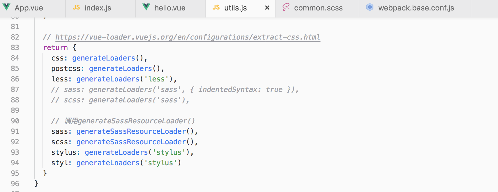
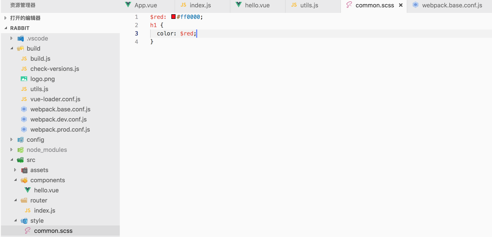

#### 一、安装node、npm、vue-cli脚手架
#### 二、新建命令：vue init webpack my-project
1. - Project name (my-project)        ------------项目名称
2. - Project description (A Vue.js project)        ------------项目描述
3. - Author (loktar <******@gmail.com>)        ------------项目创建者
4. - Install vue-router? (Y/n)        ------------Yes
5. - Use ESLint to lint your code? (Y/n)        ------------是否启用eslint检测规则
6. - Set up unit tests (Y/n)        ------------是否安装单元测试
7. - Setup e2e tests with Nightwatch? (Y/n)        ------------是否设置e2e测试
8. - Should we run `npm install` for you after the project has been created? (recommended)        ------------是否需要运行"npm install"
9. $ cd my-project         ------------进入项目
10. $ npm install         ------------安装依赖
11. $ npm run dev         ------------项目运行
#### 三、设置网页title小图标
1. 将favicon.ico放到static文件夹下，在index.html中加入
  
    ```
    <link rel="icon" href="./static/favicon.ico" type="image/x-icon">
    ```
2. 在build/webpack.dev.conf.js
  
    ```
    new HtmlWebpackPlugin({
      filename: 'index.html',
      template: 'index.html',
      inject: true,
      favicon: path.resolve('favicon.ico')   // 加上这个
    })
    ```
#### 四、使用sass
  
1. 基础依赖包安装
  
    运行命令
      
    `$ npm install sass-loader node-sass vue-style-loader --D`

2. webpack配置
  
    打开build文件夹下面的webpack.base.config.js文件，在module中添加：
    ```
    { 
      test: /\.scss$/,
      loaders: ["style", "css", "sass"]
    }
    ```

3. 页面中使用方法
  
    ```
    <style lang="scss">
      $color: #333;
    </style>
    ```

4. 安装sass-resources-loader
  
    ```
    npm install sass-resources-loader -D
    ```

5. 修改sass配置
  
    - 在 build 文件夹下找到 util.js 修改sass编译器loader的配置。添加以下代码到`exports.cssLoaders`


    ```
    // 全局文件引入 当然只想编译一个文件的话可以省去这个函数
    function resolveResource(name) {
        return path.resolve(__dirname, '../src/assets/css/' + name);  //我把提取的样式放在src/assets/css下
    }
    function generateSassResourceLoader() {
        var loaders = [
            cssLoader,
            'sass-loader',
            {
                loader: 'sass-resources-loader',
                options: {
                  // 多个文件时用数组的形式传入，单个文件时可以直接使用 path.resolve(__dirname, '../src/assets/css/common.scss'
                  resources: [resolveResource('common.scss')]  
                }
            }
        ];
        if (options.extract) {
            return ExtractTextPlugin.extract({  //要确保util.js有引入ExtractTextPlugin这个插件，通常都是有的
                use: loaders,
                fallback: 'vue-style-loader'
            })
        } else {
            return ['vue-style-loader'].concat(loaders)
        }
    }
    ```
    

    - 修改sass配置的调用为 generateSassResourceLoader()

    ```
    return {
      css: generateLoaders(),
      postcss: generateLoaders(),
      less: generateLoaders('less'),

      // 调用generateSassResourceLoader()
      sass: generateSassResourceLoader(),
      scss: generateSassResourceLoader(),
      stylus: generateLoaders('stylus'),
      styl: generateLoaders('stylus')
    }
    ```

    

  - 重启项目，全局样式生效
    
    

    感谢[webpack+vue+sass项目中，sass提取全局引用](https://juejin.im/post/5c19adff6fb9a049f91283b3)

#### 五、引入Element
1. 运行命令

    `npm install element-ui`
2. 安装loader模块

    ```
    npm install style-loader -D
    npm install css-loader -D
    npm install file-loader -D
    ```
3. 安装Element-UI模块

    `npm install element-ui`

4. 在./src/main.js中引入ELement

    ```
    import ElementUI from 'element-ui'
    import 'element-ui/lib/theme-chalk/index.css'
    Vue.use(ElementUI)
    ```

#### 六、引入第三方icon iconfont symbol

1. 创建组件SvgIcon

    ```
    // components/Icon-svg
    <template>
      <svg :class="svgClass" aria-hidden="true">
        <use :xlink:href="iconName"/>
      </svg>
    </template>

    <script>
    export default {
      name: 'SvgIcon',
      props: {
        iconClass: {
          type: String,
          required: true
        },
        className: {
          type: String,
          default: ''
        }
      },
      computed: {
        iconName() {
          return `#icon-${this.iconClass}`
        },
        svgClass() {
          if (this.className) {
            return 'svg-icon ' + this.className
          } else {
            return 'svg-icon'
          }
        }
      }
    }
    </script>

    <style scoped>
    .svg-icon {
      width: 1em;
      height: 1em;
      vertical-align: -0.15em;
      fill: currentColor;
      overflow: hidden;
    }
    </style>
    ```

2. 在src目录下创建icons文件夹将icon放置其中

    ```
    //引入svg组件
    import IconSvg from '@/components/IconSvg'

    //全局注册icon-svg
    Vue.component('icon-svg', IconSvg)
    ```
3. 在main.js中引入

    `import './icons'`

4. 打开build文件夹下面的webpack.base.config.js文件，在module中添加：

    ```
    {
      test: /\.svg$/,
      loader: 'svg-sprite-loader',
      include: [resolve('src/icons')],
      options: {
        symbolId: 'icon-[name]'
      }
    }
    ```

    ```
    // 向其中添加 exclude: [resolve('src/icons')],
    {
      test: /\.(mp4|webm|ogg|mp3|wav|flac|aac)(\?.*)?$/,
      loader: 'url-loader',
      exclude: [resolve('src/icons')],
      options: {
        limit: 10000,
        name: utils.assetsPath('media/[name].[hash:7].[ext]')
      }
    }
    ```

5. 使用icon,如果不能生效就重新安装一下依赖并运行项目

    `<svg-icon iconClass = "iconName"></svg-icon>`
#### 七、iconfont导出svg图片
1. 搜索需要的图标

    

2. 添加图标入库（购物车图标）

    

3. 添加至项目或者新建项目

    
    

4. 点击Symbol，对图标编辑--仅保存

    
    

5. 对图标进行去色

    

6. 下载保存

#### 八、对svg图片优化

*SVGO*
1. 运行`$ npm install -g svgo`

2. 实例：

    ```
    1. 单个文件使用
    $ svgo test.svg
    $ svgo test.svg test.min.svg
    2. 文件夹使用
    $ svgo -f icons
    $ svgo -f icons icons-more
    ```

#### 九、设置alias别名

    vue项目，文件与文件的引用较多，关系比较复杂，可以使用alias来简化、理顺。在`webpack.base.conf.js`文件中可以为一些常用的目录文件设置简短的别名。

    ```
    resolve: {
      extensions: ['.js', '.vue', '.json'],
      alias: {
        'vue$': 'vue/dist/vue.esm.js',
        '@': resolve('src'),
        '@components': resolve('src/components'),
      }
    }

    * extensions代表的是带这种后缀的文件可以自动解析，引入的时候不用写后缀
    // 使用
    import HelloWorld form '@/components/HelloWorld'
    ```

    也可以多加一些设置，主要看个人喜好

    ```
    alias: {
      'src': path.resolve(__dirname, '../src'),
      'components': path.resolve(__dirname, '../src/components'),
      'api': path.resolve(__dirname, '../src/api'),
      'utils': path.resolve(__dirname, '../src/utils'),
      'store': path.resolve(__dirname, '../src/store'),
      'router': path.resolve(__dirname, '../src/router')
    }

    //使用
    import stickTop from 'components/stickTop'
    import getArticle from 'api/article'
    ```

#### 十、axios

    axios是基于 promise 的 HTTP 库

1. 安装axios

    `npm install axios`

2. 全局引用，main.js

    ```
    import axios from 'axios'
    Vue.prototype.$http = axios
    ```

3. 使用

    ```
    this.$http.get('https://api.coindesk.com/v1/bpi/currentprice.json')
      .then((response) => {this.info = response})
      .catch((response) => {console.log(response)})
    ```

#### 十一、sortable.js 表格拖拽
1. 安装sortable
   
   `npm install sortable.js --save`

2. 引用
   
   `import Sortable from 'sortablejs'`

3. 使用
   t
   - 动态循环用以生成表头、表体(row-key 设置惟一性)
   ```
   <el-table :data="tableData" 
      border 
      row-key="id" 
      align="left">
      <el-table-column 
        v-for="(item, index) in col" 
        :key="`col_${index}`" 
        :prop="dropCol[index].prop" 
        :label="item.label">
      </el-table-column>
    </el-table>
   ```
   - 定义
   ```
   return {
      col: [],
      dropCol: [],
      tableData: [],
    }
   ```
   - 获取数据
   - 方法
   ```
   //行拖拽
    rowDrop() {
      const tbody = document.querySelector('.el-table__body-wrapper tbody')
      const _this = this
      Sortable.create(tbody, {
        onEnd({ newIndex, oldIndex }) {
          const currRow = _this.tableData.splice(oldIndex, 1)[0]
          _this.tableData.splice(newIndex, 0, currRow)
        }
      })
    }
   ```
   ```
   //列拖拽
    columnDrop() {
      const wrapperTr = document.querySelector('.el-table__header-wrapper tr')
      this.sortable = Sortable.create(wrapperTr, {
        animation: 180,
        delay: 0,
        onEnd: evt => {
          const oldItem = this.dropCol[evt.oldIndex]
          this.dropCol.splice(evt.oldIndex, 1)
          this.dropCol.splice(evt.newIndex, 0, oldItem)
        }
      })
    }
   ```